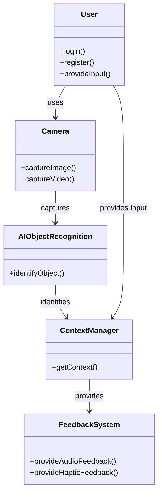

# Project InSight

This proposal outlines the comprehensive plan for developing and launching InSight, a pioneering app aimed at enhancing the lives of visually impaired individuals through innovative AI technology and user-centered design.

# Project Proposal

## Overview

InSight is a React-based application designed to assist individuals with visual impairments by leveraging camera technology to recognize objects in real-time or from photos. Utilizing Artificial Intelligence and Machine Learning, the app provides contextual feedback and alternative sensory perception to enhance the user's independence and navigation capabilities.

## Project Goals

The primary goals of InSight are:

1. To provide real-time object recognition and context for visually impaired users.
2. To offer an accessible and user-friendly interface for seamless user interaction.
3. To enhance the independence and safety of visually impaired individuals in various environments.

## Problem Identification

Visually impaired individuals often rely on others or assistive tools like canes and service animals to navigate and understand their surroundings. There is a lack of accessible, technology-driven solutions that provide real-time context and feedback, which InSight aims to address.

## Target Audience

The intended user base for InSight includes:

- Visually impaired individuals seeking enhanced navigation and object recognition support.
- Organizations and institutions supporting visually impaired individuals.

## User Needs and Features

### User Needs

The needs of the target users were identified through research and feedback from visually impaired individuals and support organizations. Key needs include real-time object recognition, contextual feedback, and safe navigation aids.

### Feature List

- **Real-time Object Recognition:** Uses Python/TensorFlow.js/Google Vision AI to identify objects.
- **Contextual Feedback:** OpenAI GPT provides context and descriptions of recognized objects.
- **Audio and Haptic Feedback:** Alerts users about objects and obstructions.
- **Continuous Mode:** Allows for ongoing object recognition without needing to tap or hold the screen.
- **Data Privacy:** Ensures full privacy mode for data storage and context recall.

### Feature Prioritization

Features were prioritized based on their impact on user safety and usability, with real-time object recognition and feedback being the top priorities.

## Implementation Details

### Tech Stack Choice

- **Frontend:** React for a responsive and modular user interface.
- **Backend:** Node.js and Express for robust server-side operations.
- **AI Libraries:** TensorFlow.js or Google Vision AI for object recognition, OpenAI GPT for context generation.

### Client Libraries

- **React:** For building the user interface.
- **Axios:** For API calls and data handling.

### Server Libraries

- **Express:** For creating API endpoints.
- **Knex:** For database management.

### Security Measures

Given the unique needs of visually impaired users, traditional password-based authentication may not be practical. Alternative security measures include:

- **Biometric Authentication:** Utilizing fingerprint or facial recognition for secure access.
- **Voice Recognition:** Allowing users to log in using voice commands.

## API and Endpoints

### API Design

Endpoints are structured to handle object recognition requests and user authentication:

- **GET /objects:** Recognize objects from the camera feed.
- **POST /users/register:** User registration using alternative authentication methods.
- **POST /users/login:** User login using alternative authentication methods.

### Security Measures

- **Biometric and Voice Authentication:** Secure and accessible methods for user authentication.
- **Data Encryption:** Protect user data in transit and storage.

## User Experience and Interface

### UI/UX Design

Guided by principles of accessibility, simplicity, and efficiency, the interface ensures that users can easily interact with the app. The design focuses on a single-page application with a viewfinder for object recognition.

### User Feedback

User feedback will be collected through:

- **Audio Feedback System:** Allow users to provide feedback verbally.
- **Support Organizations:** Organizations can provide feedback on behalf of users.

## Data Management

### Data Privacy

User data privacy is maintained through encryption and secure storage practices, with options for users to manage their data.

### Data Quality

Regular audits and validations ensure data accuracy and reliability.

## Development and Deployment Roadmap

**Create client**

- React project with routes and boilerplate pages

**Create server**

- Express project with routing, with placeholder 200 responses

**Create migrations**

- Set up database structure for object recognition data

**Create seeds**

- Gather sample object data for initial testing

**Deploy client and server projects**

- Deploy to cloud platforms so all commits are reflected in production

**Feature: Object recognition**

- Implement the object recognition functionality
- Create GET /objects endpoint

**Feature: Provide contextual feedback**

- Implement feedback functionality using OpenAI GPT
- Integrate audio and haptic feedback

**Feature: Single-page interface**

- Design and implement a single-page application with a viewfinder

**Feature: Alternative authentication**

- Implement biometric and voice recognition for user login

**Feature: Audio feedback for user input**

- Implement an audio feedback system for user input and feedback collection

**Feature: Privacy mode**

- Ensure all data is stored and managed securely with privacy considerations

**Bug fixes**

**DEMO DAY**

### Nice-to-haves

- **Advanced Navigation Features:** Implement more sophisticated pathfinding, classification and navigation aids with PyTorch/OpenCV.
- **Custom AI Models:** Develop self-trained models for better object recognition.
- **Community Sharing:** Allow organizations to share tips and experiences on behalf of users.
- **Multi-language Support:** Provide support for multiple languages in the app.
- **Offline Mode:** Allow the app to function without an internet connection for basic features.
- **Wearable Integration:** Integrate with wearable devices for more seamless user experience.
- **Environment Recognition:** Provide contextual feedback about the environment (e.g., indoor vs. outdoor).

## Risk Management

### Risk Identification

Potential risks include data breaches, AI inaccuracies, and user safety concerns.

### Risk Mitigation

Strategies include robust security measures, continuous AI model training, and clear user disclaimers.

## User Support

### Customer Support

Provide support through in-app help, email, and live chat options.

### Community Building

Engage with users through forums, social media, and feedback channels to build a supportive community.

---

## UML Diagram

Below is a Mermaid syntax UML diagram illustrating the basic structure of InSight.

# Disclaimer

This proposal outlines a long-term overview proposal for Project InSight. Please note that features, technologies, and implementation details might change depending on circumstances and user feedback. My aim is to remain flexible and responsive to the needs of the end users and project requirement, ensuring that the final product provides the best possible support and functionality for visually impaired individuals.
